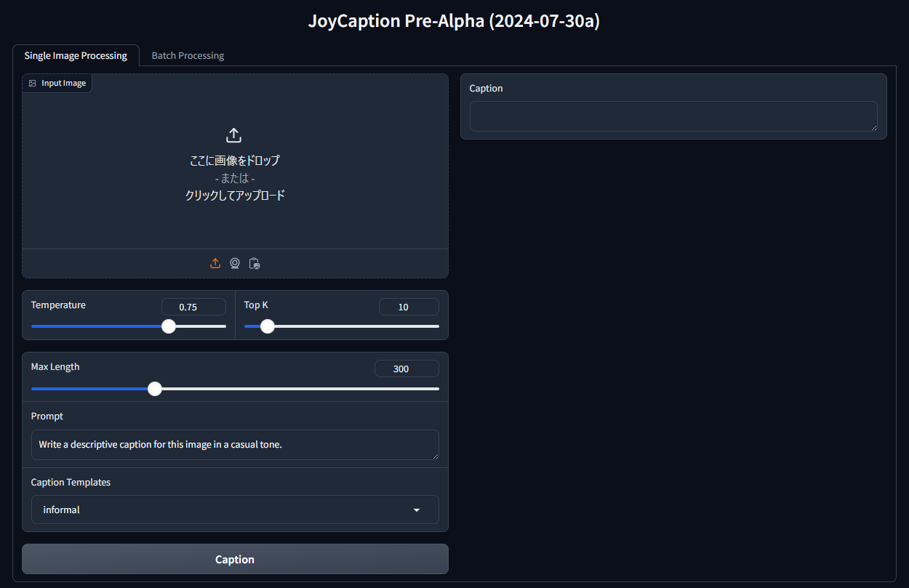

An example chatbot using [Gradio](https://gradio.app), [`huggingface_hub`](https://huggingface.co/docs/huggingface_hub/v0.22.2/en/index), and the [Hugging Face Inference API](https://huggingface.co/docs/api-inference/index).

## Original Repository

[fancyfeast/joy-caption-pre-alpha](https://huggingface.co/spaces/fancyfeast/joy-caption-pre-alpha)

## Requirements

10GB VRAM in 8bit
20GB VRAM in 16bit

Tested on Python 3.10
Tested on Pytorch w. CUDA 12.1.

## Features

- Temperature and Top K, prompt and max Length settings
- Batch processing and Single image processing



## Setup

Intended for use with WSL.
You must obtain Llama3.1-8B access on HuggingFace in advance.

1. Install the requirements:

```sh
python -m venv venv
source venv/bin/activate

# Install the requirements. The CUDA version should be appropriate for your environment.
pip install torch==2.4.0 torchvision==2.4.0 torchaudio==0.19.0 --index-url https://download.pytorch.org/whl/cu121
pip install -r requirements.txt
```

2. Run the app:

```sh
# Run on 16bit
python app.py --token YOUR_HF_TOKEN

# Run on 8bit
python app.py --token YOUR_HF_TOKEN --use-8bit
```

3. Open the browser and go to `http://localhost:7860/`.
4. Enjoy

### Arguments

- `--token`: Your Hugging Face token.
- `--use-8bit`: Use 8bit model. Default is 16bit.
- `--device`: Device to run the model on. Default is `cuda:0`.
- `--not-wsl`: If you are not using WSL, add this flag. If the flag is not set, Windows paths will be automatically converted to WSL paths internally. For example, `C:\hoge\fuga` becomes `/mnt/c/hoge/fuga`.
